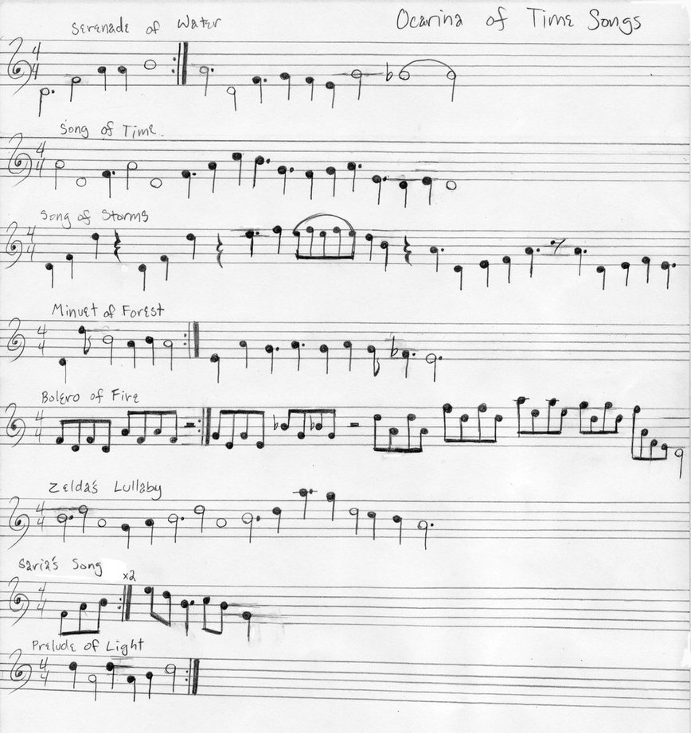

!SLIDE center transition=scrollLeft
# Rocking out with Nodejs
### by Garren Smith

!SLIDE center transition=scrollLeft
# About me

!SLIDE bullets incremental transition=scrollLeft
# Table of Contents

* What is nodejs? (Opening Notes)
* What makes nodejs a Rockstar?
* Up and coming libraries (Albums)
* Demo
* Rocking out

!SLIDE bullets incremental transition=scrollLeft
#What is Nodejs?

  * Server-side Javascript
  * Built on Google's V8 js engine
  * Evented, non-blocking I/O. 

!SLIDE center transition=scrollLeft
#How does it work?

!SLIDE center transition=scrollLeft
#How does it work?

!SLIDE center transition=toss
# huh?
  

!SLIDE center transition=scrollLeft
#Traditional blocking code
    @@@javascript
        var result = db.getUser(1);
        
        thenDoSomeThingElse();
        
!SLIDE center transition=scrollLeft
#Non-blocking code
    @@@javascript
        db.getUser(1, function (result) {
          // do something with result
        });

        DoSomeThingElse();

!SLIDE center transition=scrollLeft
#Lets see the code!

!SLIDE transition=scrollLeft
#Hello World
    @@@javascript
      setTimeout(function () {

        console.log("world");
        
        }, 2000);

        console.log("hello");

!SLIDE commandline incremental transition=scrollLeft
#Hello World Output

    $node hello.js
    hello
    ... wait 2 seconds ...
    world

!SLIDE transition=scrollLeft
#Hello World Webserver
    @@@javascript
      var http = require('http');
      
      
      http.createServer(function (req, res) {

        res.writeHead(200, {'Content-Type': 'text/plain'});
        res.end('Hello World\n');
      
      }).listen(8124, "127.0.0.1");

!SLIDE commandline incremental transition=scrollLeft
#Hello World Webserver

    $curl -i 127.0.0.1:8124

    HTTP/1.1 200 OK
    Content-Type: text/plain
    Connection: keep-alive
    Transfer-Encoding: chunked

    Hello World

!SLIDE center transition=scrollLeft
# Why should I use it?

!SLIDE bullets incremental transition=scrollLeft
# Why should I use it?
* Efficiency
* No deadlocks, threadings
* Speed

    

      
  
    

