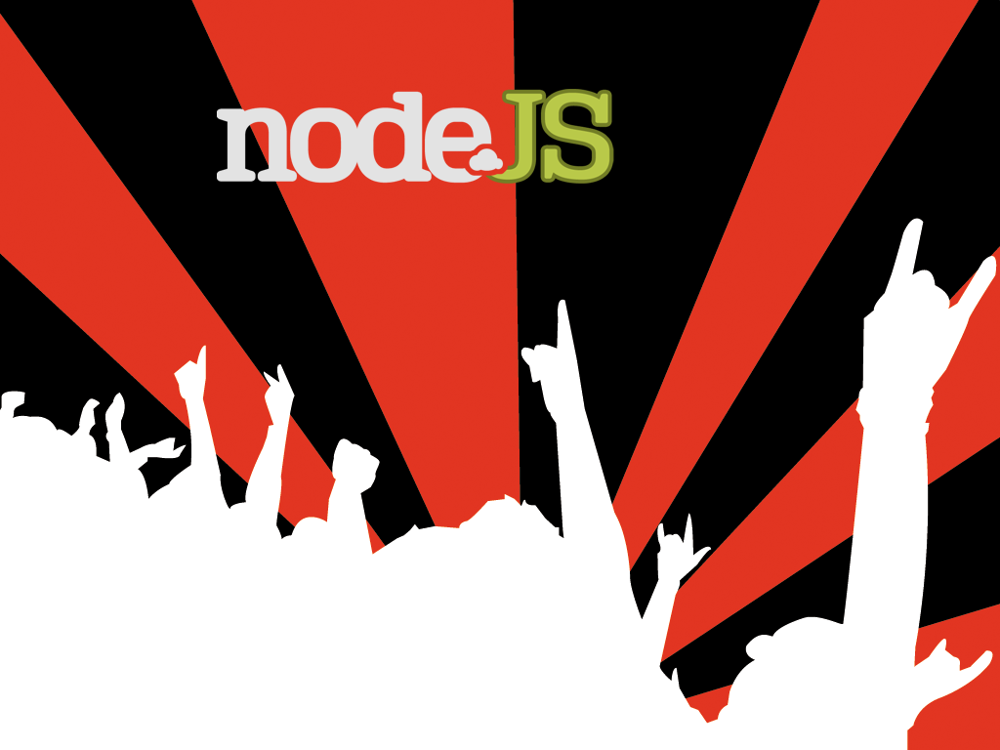

!SLIDE center 
# Rocking out with Nodejs
### by Garren Smith

!SLIDE center
# About me

!SLIDE bullets incremental
# Table of Contents

* Opening Notes
* Rockstar
* Discography
* Demo
* Fade out

!SLIDE bullets incremental
#What is Nodejs

  * Server-side Javascript
  * Built on Google’s V8 js engine
  * Evented, non-blocking I/O. 

!SLIDE center
#How does it work?

!SLIDE center
#How does it work?

!SLIDE center
# huh?
  

!SLIDE center
#Traditional blocking code
    @@@javascript
        var result = db.getUser(1);
        
!SLIDE center
#Non-blocking code
    @@@javascript
        db.getUser(1, function (result) {
          // do something with result
        });

!SLIDE center
# Why should I use it?

!SLIDE
#Hello World
    @@@javascript
      setTimeout(function () {
        console.log("world");
        }, 2000);

        console.log("hello");

!SLIDE commandline incremental
#Hello World Output

    $node hello.js
    hello
    ... wait 2 seconds ...
    world
  
    

